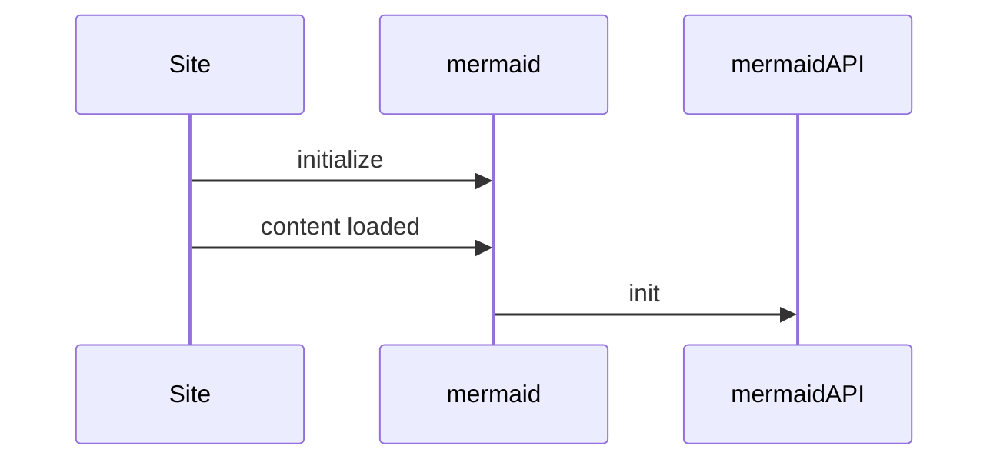
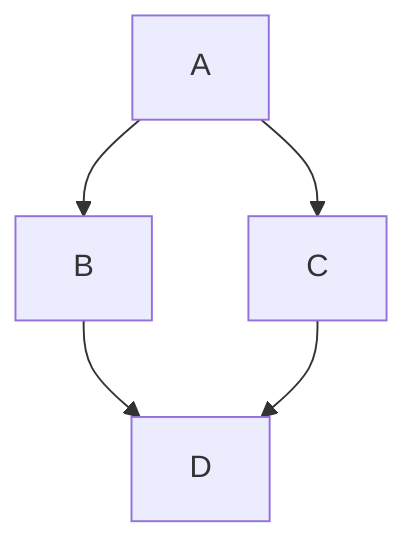

Learning Mermaid 

## Generate some mermaid


## Flow chart


## Sequence diagram - SQL injection
```mermaid
sequenceDiagram
    injection SQL Injection
    
    


## Python markdown

```python
s = "Python syntax highlighting"
print s
```

Download the generated package, unzip and delete the following two from the extracted files:

- `browserconfig.xml`{: .filepath}
- `site.webmanifest`{: .filepath}

And then copy the remaining image files (`.PNG`{: .filepath} and `.ICO`{: .filepath}) to cover the original files in the directory `assets/img/favicons/`{: .filepath} of your Jekyll site. If your Jekyll site doesn't have this directory yet, just create one.

The following table will help you understand the changes to the favicon files:

| File(s)             | From Online Tool                  | From Chirpy |
|---------------------|:---------------------------------:|:-----------:|
| `*.PNG`             | ✓                                 | ✗           |
| `*.ICO`             | ✓                                 | ✗           |

>  ✓ means keep, ✗ means delete.
{: .prompt-info }

The next time you build the site, the favicon will be replaced with a customized edition.
